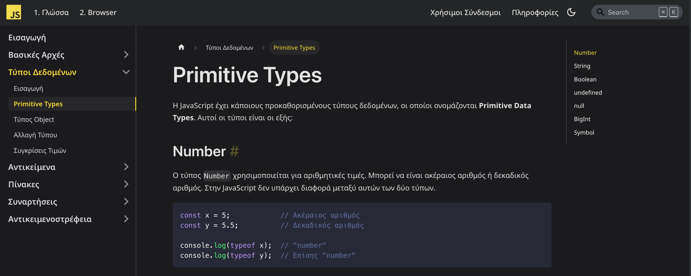

<p align="center">
	
</p>

Η σελίδα αυτή δημιουργήθηκε για να παρέχει στους Web Developers πληροφορίες σχετικά με τη γλώσσα προγραμματισμού JavaScript στα Ελληνικά. Από τις βασικές έννοιες έως και προχωρημένα θέματα, με λεπτομερείς εξηγήσεις και παραδείγματα.

<p align="center">
	
</p>

## Στόχος του έργου

Το υλικό της σελίδας αρχικά δημιουργήθηκε ως βοήθημα εργαστηρίων σε ένα απο τα μαθήματα του Τμήματος Ψηφιακών Συστημάτων, Πανεπιστημίου Πειραιώς. Το μάθημα αυτό αποτελεί την εισαγωγή στον διαδικτυακό προγραμματισμό και τις τεχνολογίες του Web.

Στη συνέχεια, το υλικό επεκτάθηκε και ανανεώθηκε με σκοπό να καλύψει όλες τις πτυχές της JavaScript. Έτσι γεννήθηκε η ιδέα της δημιουργίας μιας ιστοσελίδας που θα περιείχε όλο το υλικό σε μορφή documentation.

Το υλικό και ο κώδικας της σελίδας είναι και θα είναι open source, δωρεάν και διαθέσιμα σε όλους. Μπορεί να χρησιμοποιηθεί ελεύθερα για εκπαιδευτικούς σκοπούς χωρίς καμία περιοριστική άδεια.

## Τοπική εκτέλεση

### Απαιτήσεις

Για την τοπική εκτέλεση της σελίδας, απαιτείται η εγκατάσταση του Node.js και του npm. Μπορείτε να κατεβάσετε το Node.js από τη διεύθυνση [https://nodejs.org](https://nodejs.org).

### Οδηγίες

Για την τοπική εκτέλεση της σελίδας, ακολουθήστε τα παρακάτω βήματα:

1. Κατεβάστε τον κώδικα της σελίδας:

```bash
git clone https://github.com/adreaskar/javascript.gr.git
```

2. Μεταβείτε στον φάκελο του κώδικα:

```bash
cd javascript.gr
```

3. Εγκαταστήστε τα dependencies:

```bash
npm install
```

4. Ξεκινήστε τον τοπικό server:

```bash
npm run start
```

Η σελίδα θα είναι διαθέσιμη στη διεύθυνση [http://localhost:3000](http://localhost:3000).

### Οδηγίες για Docker

Για την τοπική εκτέλεση της σελίδας με χρήση Docker, ακολουθήστε τα παρακάτω βήματα:

1. Εγκαταστήστε το Docker και το Docker-Compose:

-   [Docker Install documentation](https://docs.docker.com/install/)
-   [Docker-Compose Install documentation](https://docs.docker.com/compose/install/)

2. Δημιουργήστε ένα αρχείο docker-compose.yml παρόμοιο με το παρακάτω:

```yml
services:
    jsdocs:
        image: 'adreaskar/javascriptgr:latest'
        restart: unless-stopped
        ports:
            - '3000:3000'
```

3. Εκτελέστε το stack με την χρήση της εντολής:

```bash
docker-compose up -d
```

4. Η σελίδα θα είναι διαθέσιμη στη διεύθυνση [http://localhost:3000](http://localhost:3000).

## Συνεισφορά

Όλοι είναι ευπρόσδεκτοι να δημιουργήσουν ένα pull request σε αυτό το έργο, για τυχόν διορθώσεις ή βελτιώσεις του υλικού. Η συνεισφορά είναι προτιμότερο να γίνεται σε νέο branch, ενώ οι επίσημες εκδόσεις να δημιουργούνται από το branch `master`.

Σύντομα θα ανακοινωθούν οδηγίες για τη συνεισφορά στο υλικό της σελίδας.

### Συνεισφέροντες

Ιδιαίτερες ευχαριστίες σε [όλους τους συνεισφέροντες](https://github.com/adreaskar/javascript.gr/graphs/contributors).

## Υποστήριξη

Εάν το υλικό της σελίδας σας φάνηκε χρήσιμο και θέλετε να στηρίξετε την προσπάθεια του javascript.gr, μπορείτε να το κάνετε μέσω του Buy Me A Coffee:

<a href="https://www.buymeacoffee.com/adreaskar" target="_blank"></a>

## Επικοινωνία

Για οποιαδήποτε ερώτηση, παρατήρηση ή πρόταση, μπορείτε να στείλετε ένα email στο hey@javascript.gr.

Μπορείτε επίσης να [συμμετέχετε στις συζητήσεις](https://github.com/adreaskar/javascript.gr/discussions)
